# **App Manifest**

The manifest.json file contains information such as the platform version used by a product, locations on the product UI where an app can be rendered (for front-end apps), dependent packages used by the app, SMI functions that can be invoked from an app’s front-end component, events and the corresponding callbacks (for serverless apps), and the Node.js and SSDK versions used to build, test, validate, and pack the app.

The manifest.json lists the configured urls for api calls that the app invokes to construct and send secure HTTP requests to the third-party domains. manifest.json whitelists all the third-party domains with which the app can interact. 

### **Sample manifest.json:**

```json
{
    "platform-version": "1.0",
    "product": {
    "surveysparrow": {
      "location":{
        "full_page_app":{
          "url": "index.html",
          "icon": "styles/images/icon.svg"
        }
      },
      "events": {
        "onSubmissionComplete": {
          "handler": "onSubmissionComplete"
        }
      },
      "functions":{
        "callSmiEvent":{
          "timeout":10        
        }
      }
    }
    },
    "whitelisted-domains":["https://www.google.com"],
    "engines": {
        "node": "18.16.0",
        "ssdk": "1.3.0"
    }
  
}


```

|S.No | Attribute name | Data type | Description |
| ------------- |:-------------:| :-------------: |-----:|
|1.| platform-version | String |  When the app files are created, this field value is auto-generated. The value specifies which version of the platform is used to build the app. The version information is used to ensure backward compatibility when a new platform version is released.|
|2.| product <br/>**Mandatory** | Object | Associates a surveysparrow product with the information that is necessary to render the app on the specified product.(child parameter: surveysparrow) |
|3. | surveysparrow<br/>**Mandatory** | Object | Specifies information that is necessary to render the app on the surveysparrow UI.(Child parameter: location) |
|4. | location <br/>**Mandatory for all except serverless apps** | Object | Specifies the multiple locations on the SurveySparrow UI, where the app is to be rendered.(Child parameter: full_page_app) |
|5.| full_page_app<br/>**(this is one of the eleven locations where the app is rendered in UI)** | Object | Specifies information necessary to render the app on the SurveySparrow UI, in the account level integration page under installed Apps<br/>Attributes: url, icon. The location should be one of [full_page_app](#full_page_app), [new_survey_modal](#new_survey_modal), [builder_integrations_list](#builder_integrations_list),[response_details](#response_details),[contact_details](#contact_details),[new_survey_shares](#new_survey_shares), [contact_import](#contact_import), [response_import](#response_import), [home_navigation](#home_navigation), [home_left_panel](#home_left_panel), [survey_settings](#survey_settings) |
|6.| url<br/>**Mandatory** | String | Specifies the relative path from the app project directory to the index.html file based on which the app is rendered. The contents of the index.html file are used to render the app in an IFrame at the specified location. Default value:index.html (file in the app directory)
|7.| icon<br/>**Mandatory** | String | Specifies the relative path from the app project directory to an image file (in SVG format). The image is used as the app’s icon when the app is rendered on the UI. The resolution of the image needs to be 64x64 pixels. Default value: icon.svg (file in the app directory) | 
|8. | engines | Object | Specifies the Node.js version and SSDK version that are used to build the app. SSDK auto-populates this value.|
|9.| events<br/>**Mandatory for serverless apps** | Object | Contains the various serverless events and the corresponding call-back function names, specified in the following format:<br/>"events":{"onSubmissionComplete":{"handler":"submissionHandler"}} |
|10.|functions<br/>**Mandatory for SMI** | Object | Lists the SMI functions (server methods) defined in the exports code block of server.js, in the following format:<br/>"functions":{"surveyConverter":{"timeout":10}}<br/>Child attribute:timeout (integer): Time in seconds beyond which the app execution times out, if the SMI function does not return a valid response to the front-end component. You can specify an appropriate timeout value based on the SMI function.<br/>Valid values : 5, 10, 15, and 20 |
|11.| whitelisted_domains<br/>**Mandatory** | Array of Strings | To make secure HTTP calls to third-party domains, apps must use the Request Methods. For the method to work, in manifest.json, the third-party domains must be listed as the whitelisted-domains.<br/>It should be in the following format:`[https://(.*).surveysparrow.com(.*)]`|

There are totally eleven locations where the app can be rendered inside surveysparow:

Like already mentioned the app's location should be mentioned in manifest.json.

Screenshots of app in every location:

- ### **full_page_app**

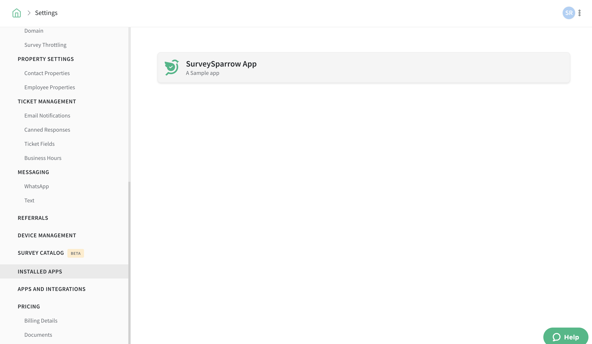

- ### **new_survey_modal**


- ### **builder_integrations_list**

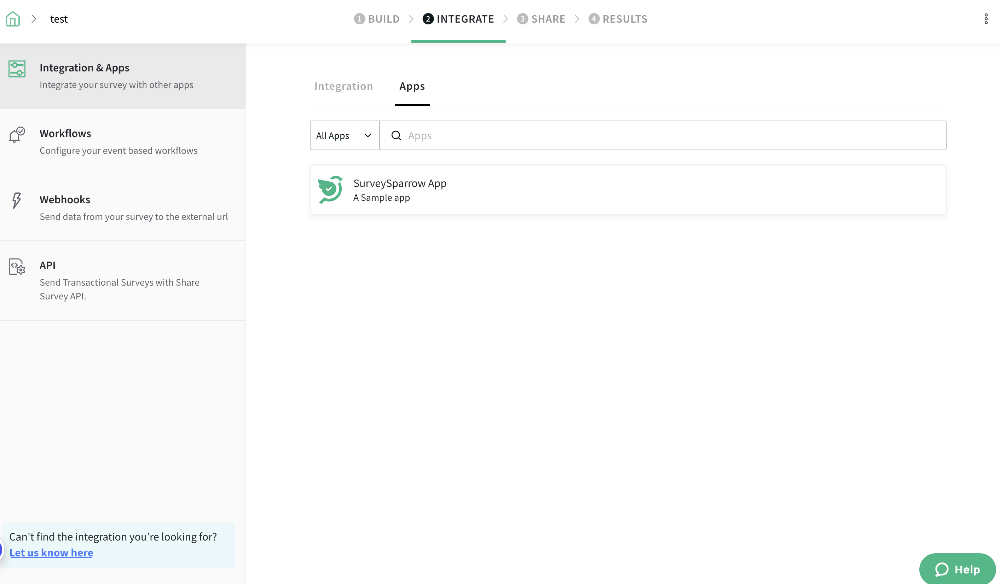

- ### **response_details**
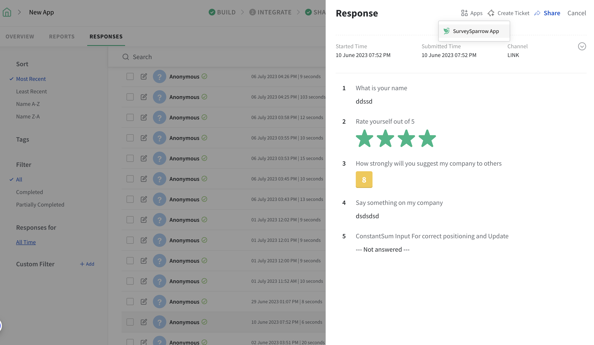

- ### **contact_details**
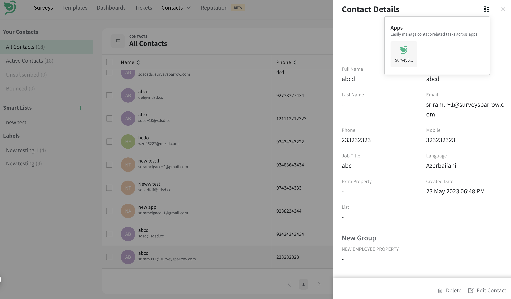

- ### **new_survey_shares**
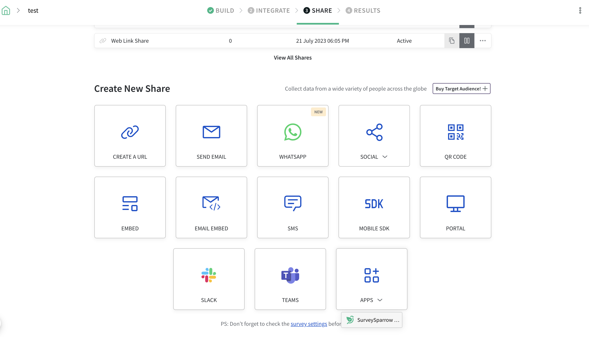

- ### **contact_import**
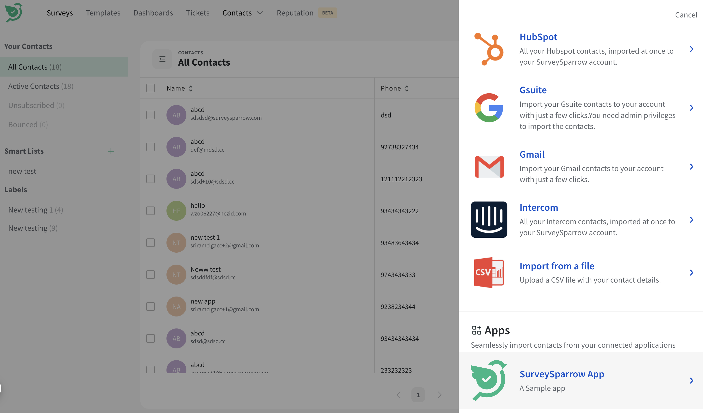

- ### **response_import**
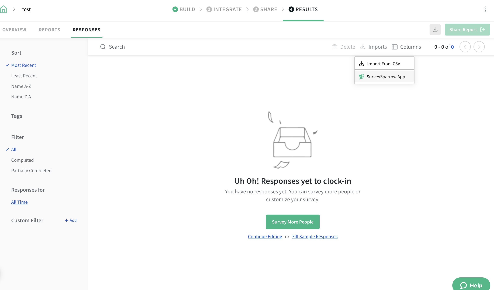

- ### **home_navigation**
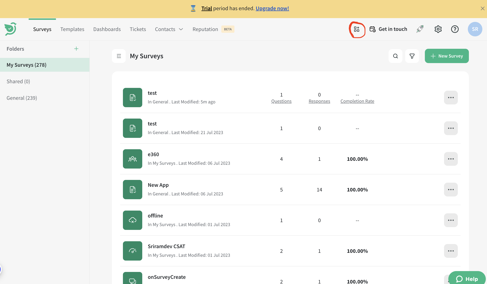
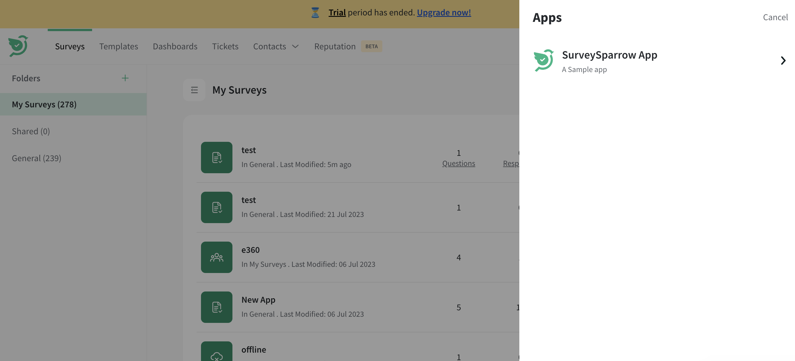

- ### **home_left_panel**
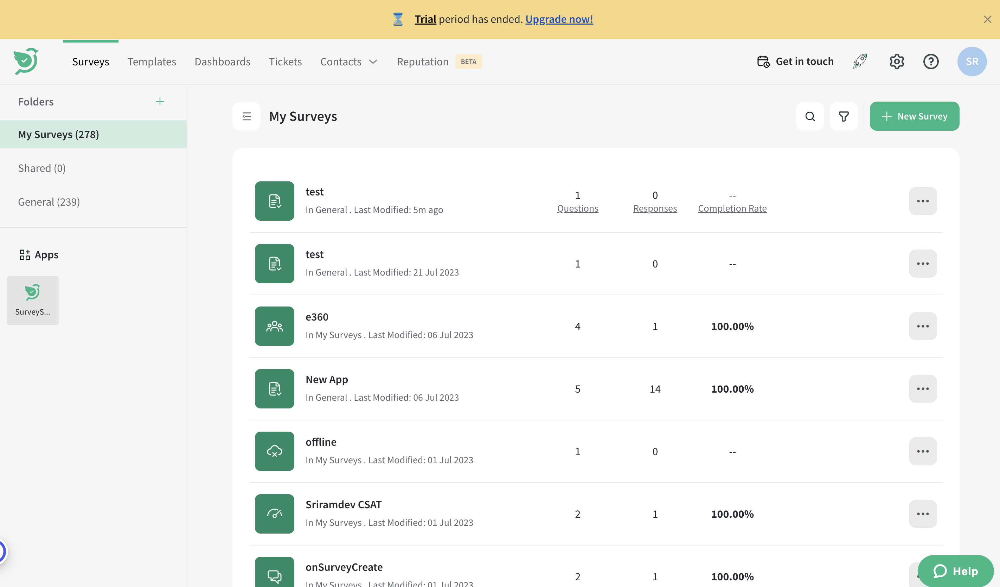

- ### **survey_settings**
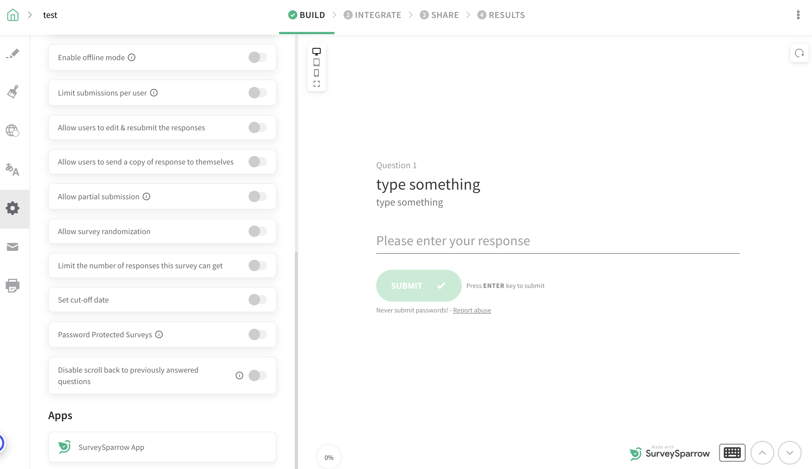


 


