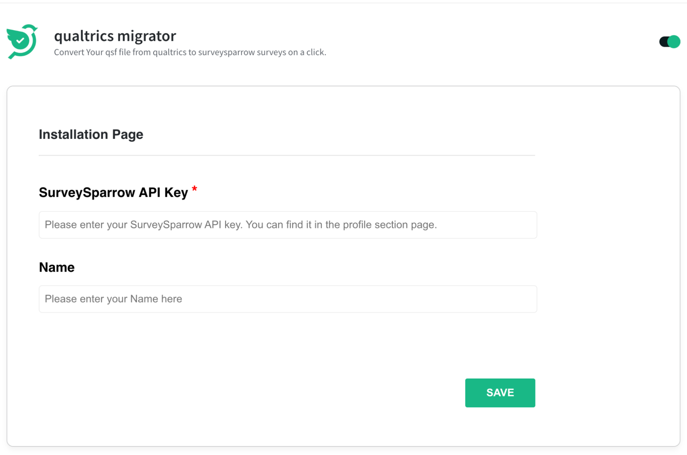
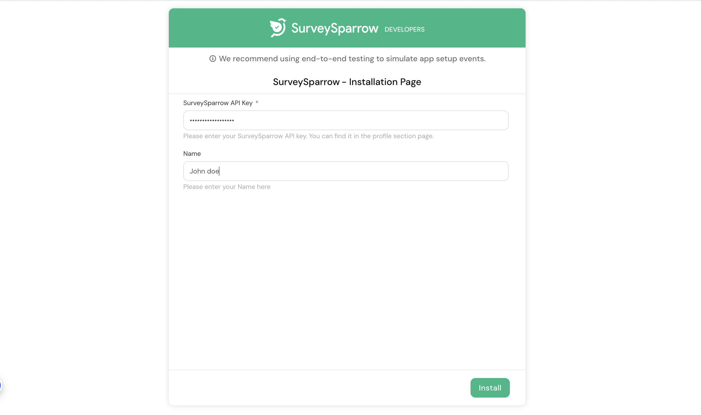

# **Installation Parameters**

The SSDK enables you to define and use parameters whose values app users can set when they install an app. These parameters are termed installation parameters or iparams. To define and use iparams:

&emsp;&emsp; 1. Configure the iparams. During app installation, the configured iparams are displayed on an installation page. App users can enter appropriate values for the iparams and click INSTALL. The entered values are validated and saved.

&emsp;&emsp; 2. In the app logic, use the `<%= iparams.api_key %>` on the Request method (for secure iparams), to retrieve the iparam values.

&emsp;&emsp; Note: To prevent exposure of sensitive iparam information, secure iparams can only be retrieved through the Request Method, as part of HTTPS request headers.

For serverless apps, the configured iparams are passed as part of event payloads. The app logic can retrieve the iparams values from the payload.

## **Configure:**

1. From your app’s root directory, navigate to the config/iparam.json file.

2. Configure iparams by using the following sample format.
 
|s.no| Attribute name | Data Type | Description |
| ------------- |:-------------:| :-------------: |-----:|
|1.| display_name | String | Identifier of a parameter on the installation page.|
|2.| description | String | Helper text that is displayed along with the parameter, on the installation page. The description can include examples. |
|3.| type | String | Type of input field displayed, for the iparam, on the installation page. Possible values: text, email, number, phone_number, date, url, api_key |
| 4.| required | boolean | Specifies whether the iparam is displayed as a mandatory parameter. An asterix is displayed next to the parameter on the installation page. |
| 5. | type_attributes | Object | Specifies the product with the key value pair as product and product name respectively. For eg: {product: surveysparrow}. (this field is only for api_key type)

## **Configure iparams.json:**

```json 
{
  "surveysparrow_api_key": {
      "display_name": "SurveySparrow API Key",
      "description": "Please enter your SurveySparrow API key. You can find it in the profile section page.",
      "required": true,
      "secure": true,
      "type": "api_key",
      "type_attributes": {
        "product": "surveysparrow"
      }
    }
  ,
  "name": {
    "display_name": "Name",
    "description": "Please enter your Name here",
    "type": "text",
    "required": false
  }
}

```

## **Installation Page:**



## **Installation Page on local app:**

while developing the app in local environment you can access the iparams page [here](https://localhost:30001/custom_configs)




