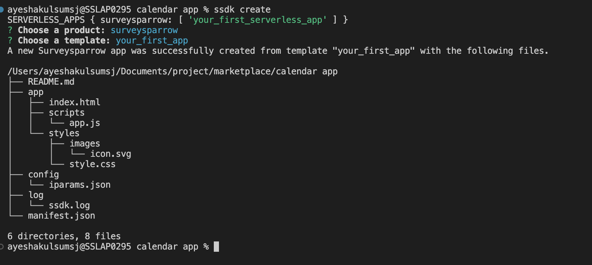

# **Your First App**

The goal of this tutorial is to help you understand the basics of app development. Here, you will build an app using the SurveySparrow platform.

For this tutorial, choose the **your_first_app** template.

### **Create:**

- To get started, open the terminal window, navigate to the directory under which you want to create your app, and type the following command. Note that this directory must be empty.

```bash
ssdk create
```



### **Code Walkthrough**

Let’s take a closer look at the files that were created in the app.

- **README.md**

&emsp;&emsp;&emsp; Developers need to maintain a proper README file so when there is a change in ownership of the code base, a new developer can easily understand the various nuances of the code.

- **manifest.json**

&emsp;&emsp;&emsp; The manifest file is used to store configuration information for the app.

```json
{
  "platform-version": "1.0",
  "product": {
    "surveysparrow": {
      "location": {
        "build_settings": {
          "url": "index.html"
        }
      },
      "events": {
        "onSubmissionComplete": {
          "handler": "submissionHandler"
        }
      }
    }
  },
  "whitelisted-domains": [
    "https://*.surveysparrow.com",
    "https://*.surveysparrow.test"
  ],
  "engines": {
    "node": "14.20.0",
    "sdk": "8.6.7"
  }
}
```

The platform-version key is automatically generated and used to infer the platform version that your app uses. This is used to ensure backward compatibility when a new version of the framework is released.

The product key is used to specify the product and location in which the app is rendered. This app is to be rendered in the account level settings page location(full_page_app). url and icon specify the path (from the /app directory) to the template and icon files rendered in that location.

- **app/styles/images/icon.svg**

&emsp;&emsp;&emsp; This is the app icon specified in the manifest file. It is displayed while showing the app in the UI. The app icon file is of SVG type with a resolution of 64 x 64 pixels.

- **app/index.html**

&emsp;&emsp;&emsp; Apps in the new surveysparrow UI are rendered inside an IFrame. This file contains the HTML markup for the app. It is a simple template that displays an image along with text which is dynamically generated in the app.js file.

- **The index.html file includes the following:**

&emsp;&emsp;&emsp; **client.js** - This JS file enables the app to communicate with the parent page. The file is mandatory as the app runs in an IFrame and needs to communicate with the parent page in order to access data, listen to events, and trigger interface actions.

&emsp;&emsp;&emsp; **app.js** - Establishes connection with the parent page to retrieve information about the requester.

&emsp;&emsp;&emsp; **style.css** - App specific stylesheet that contains style information for various UI components of the app.

The new SurveySparrow UI is built as a single-page application. Single-page applications do not reload the entire page when the context is changed, only the relevant sections are modified. If an agent is already on a survey builder page and navigates to the integration page, only certain sections of the page are reloaded.

When the page is loaded for the first time, the app.js file registers for the app.initialized() event.

As apps are rendered in an IFrame, the app and underlying page communicate through methods by using the client object. The client.data.get(‘getSurveyId’) method uses a Data method to retrieve the surveyId in the integration page at survey level.

- app/styles/style.css

&emsp;&emsp;&emsp; The app specific stylesheet which contains style information for various UI components of the app.

