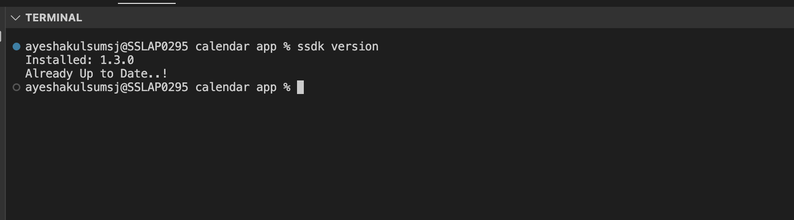
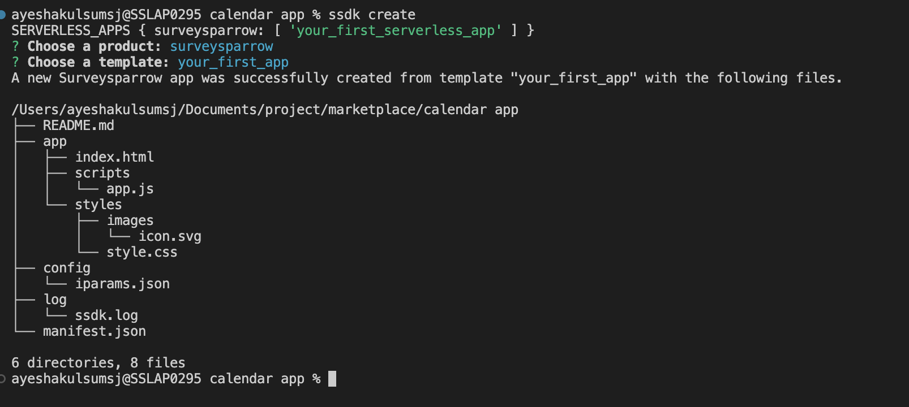
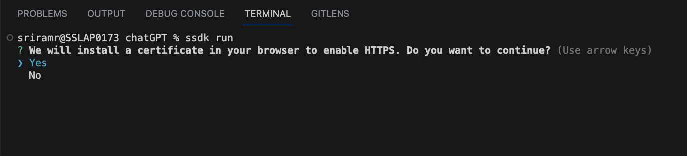
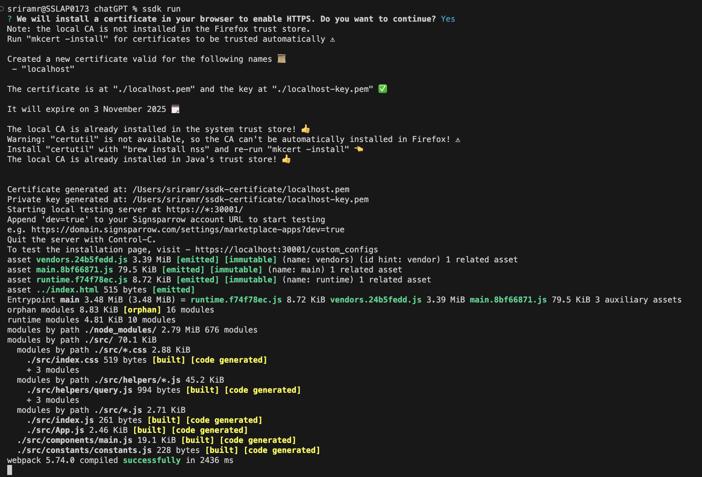

# **Quick Start**

### You can build Sparrow apps that will automate most of your development tasks by using the following steps.

#### 1. [Initial Requirements](#inital-requirements)
#### 2. [Install Sparrow CLI](#install-the-sparrow-cli)
#### 3. [Develop an App](#develop-an-app)
#### 4. [Test the App](#test-a-front-end-app)
#### 5. [Validate and Pack](#validate-and-pack)

<br>
Apps built on the SurveySparrow platform are compatible with the latest and immediately preceding version of the following browsers.

- Google Chrome
- Firefox
- Edge
- Arc

---

## **Inital requirements**

### **Install NVM**:

NVM (Node Version Manager) is a tool that allows you to easily manage multiple versions of Node.js on your system. Here are the steps to install NVM
 
#### **On Mac OS**:

- Install brew using the commands given below. If you have already installed it, please skip this step.

```bash
/bin/bash -c "$(curl -fsSL https://raw.githubusercontent.com/Homebrew/install/HEAD/install.sh)"
```

- To Verify the installation

```bash
brew --version
```

- Install NVM via brew

```bash
brew install nvm
```

#### **on Windows OS**:

- Installation using the Chocolatey package manager.
  - Launch Terminal in Administrator mode.
  - Run the command.

```bash
Set-ExecutionPolicy Bypass -Scope Process -Force; [System.Net.ServicePointManager]::SecurityProtocol = [System.Net.ServicePointManager]::SecurityProtocol -bor 3072; iex ((New-Object System.Net.WebClient).DownloadString('https://community.chocolatey.org/install.ps1'))
```

- Verify Chocolatey installation using the command given below.
Verify NVM installation

```bash
choco -v
```

- Install NVM through the Chocolatey package manager.

```bash
choco install nvm
```
- Install via installers

  - Download the NVM Setup from [here](https://github.com/coreybutler/nvm-windows/releases/download/1.1.11/nvm-setup.exe) and Complete the installation process using the steps given [here](https://github.com/coreybutler/nvm-windows#installation--upgrades).

#### **on Ubuntu**:

- If you don't have curl installed already, install it.

```bash
sudo apt-get install curl
```

- Run the NVM installation script as shown below

```bash
curl -o- https://raw.githubusercontent.com/nvm-sh/nvm/v0.39.3/install.sh | bash
```

- The script clones the nvm repository to ~/.nvm, and attempts to add the source lines from the snippet below to the correct profile file (~/.bash_profile, ~/.zshrc, ~/.profile, or ~/.bashrc).

```bash
export NVM_DIR="$([ -z "${XDG_CONFIG_HOME-}" ] && printf %s "${HOME}/.nvm" || printf %s "${XDG_CONFIG_HOME}/nvm")"
[ -s "$NVM_DIR/nvm.sh" ] && \. "$NVM_DIR/nvm.sh"
```
   - When faced with any issues, follow the instructions given [here](https://github.com/nvm-sh/nvm) For more details, refer to

#### **Verify NVM installation**

```bash 
nvm --version
```

### **Install Node:**

- To install Node.js 18 via nvm, follow the given steps.

```bash 
nvm install 18
```
- To use Node.js 18

```bash
nvm use 18
```

- To verify that the node is installed correctly, run the following commands

```bash 
node –-version
```

## **Install the sparrow CLI**

- To install the latest CLI version, run the following command.

```bash
npm install https://ssdk.surveysparrow.dev/ssdk.tgz -g
```

- To install mkcert and nss via brew in MacOS for installing ssl certificate of the ssdk(running in https) on the browser

```bash
brew install mkcert
```
```bash
brew install nss # if you use Firefox
```

- Run the following command to verify the CLI installation.

 ```bash
 ssdk version
 ```
 
 
 #### **Installation summary**
- Ensure that the versions of the corresponding packages are as suggested or higher.

```bash
#for nvm -v
0.38.0
# for node -v
v18.12.0
# for npm -v
9.5.1
# for ssdk version
0.1.0
```
## **Develop an App:**

&emsp; You can use the following steps to create an app that displays a sample text in the ‘app & integration’ section of setting page.

- From the command line, navigate to the empty directory in which you want to create an app.

- Run the following command:
```bash
 ssdk create
```
- Select your_first_app. A new app is created based on the your_first_app template.

 

 **The following directories and files are created as a result of the ssdk create command.**

| DIRECTORY/FILE | DESCRIPTION |
| ------------- |:-------------:|
| app/*      | Contains all the files required for the front-end component of an app. The JS file follows the ES5 standard.|
| app/index.html     | Contains files to render front-end components of an app. This is the first page that is loaded when the app is activated. When building an app, if the app uses Data methods, Request method, Installation Parameters, or Data Storage, update the index.html file with the following reference to client.js: `<script src=”https://sparrow.cloudfront.net/client.js"></script>`     |
| app/scripts | Contains all the javascript files required to support the front-end functionality of an app.  |
| app/scripts/app.js |  Contains the app logic to display. |
| app/styles|  Contains the styles required for the front-end components of an app. |
|app/styles/styles.css | Contains CSS rules that are incorporated to HTML files, when referenced.|
| app/styles/images | Contains images that can be used in the app. |
| app/styles/images/icon.svg | Contains the app icon. The icon file should be of SVG type with a resolution of 64 x 64 pixels. |
| config/* | Contains the installation parameters and oauth configuration files. |
| config/iparams.json* | Contains all the installation parameters whose values are set when the app is installed. For more information, see Installation Parameters. |
| manifest.json* | Contains details such as the platform version the app uses, product to which the app belongs, event listeners for serverless apps, SMI functions that can be invoked from the app’s front end component.|
| README.md | Contains additional instructions, information, and code-related specifications pertaining to the app.|


**Note : When building an app, do not modify these file/folder names.**

## **Test a front-end app**

- From the command line, navigate to the directory that contains the app related files and run the following command.

```bash
ssdk run 
```
- Upon running ssdk run command you will be prompted to install a certificate on your browser for establishing https connection between your loacal app and your browser.


- After you agree to install ssl certificate on your browser, the ssl certificate will be installed on your browser and the app will start running on https.


- Log in to your SurveySparrow account.

- To the SurveySparrow account URL, append `?dev=true`

&emsp;&emsp;&emsp;Example URL:
&emsp;`https://subdomain.surveysparrow.com/?dev=true`

- To allow the Chrome browser to connect to the test server that runs on HTTP,

 &emsp;&emsp;&emsp; - Navigate to Settings -> Advanced -> Privacy and security -> Site settings -> Insecure content.

 &emsp;&emsp;&emsp; - In the Allow section, click Add and enter the account URL.
Example URL:` https://subdomain.surveysparrow.com`

- To test **your_first_app**, from the homepage > Settings, select “apps & integrations”. You can see your app **“your_first_app”** displayed in app listing section

## **Validate and Pack:**

To check if the app is error-free and package it for submission, follow the given steps.

- To validate the code, run the following command.
```bash
ssdk validate [--app-dir DIR]
```
Here, DIR is the relative or absolute path to the project directory. If there are errors in the code, corresponding violations are displayed.

- To pack the app for submission, run the following command.
```bash
ssdk pack [--app-dir DIR]
```
The command generates the dist/my_first_app.zip file.

- To publish the app to the Sparrow AppNest, navigate to the [Sparrow developer portal](https://appnest.surveysparrow.com) and upload the packed file.


In case if you want to uninstall the ssdk do the following steps:

```bash
npm uninstall ssdk -g
```
```bash
rm -r ~/.ssdk
```


