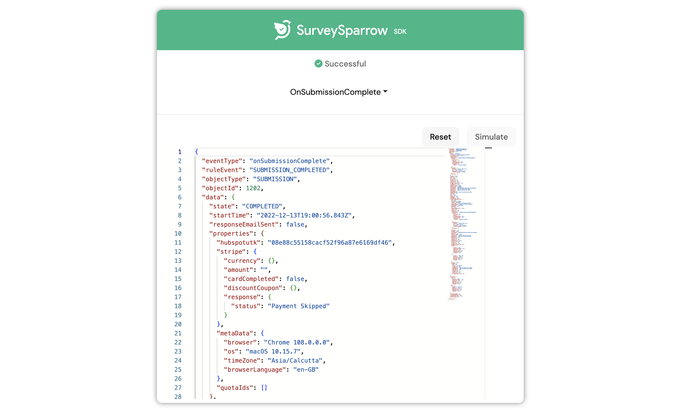

# **Severless**


The SurveySparrow app development platform includes a serverless environment to enable you to create apps that run in response to events such as SurveySparrow product, app setup, and external events. Serverless computing involves servers, but they are abstracted away from developers.

To use this feature, all you need to do is configure an event listener and the callback method. When the event occurs, the callback method is executed on a server. 


Whenever an event happens in the server of the SurveySparrow then that event is captured and sent to the app. With this payload the app can do whatever it wants.

In order to capture and use this event the app has to register what are all events that it is using in the `manifest.json` file.

Under the product name:

```json
"events": {
  "<eventName>": {
    "handler": "<eventCallbackMethod>"
  },
  "<eventName>": {
    "handler": "<eventCallbackMethod>"
  }
}
```

Sample:
```json
  "events":{
    "onSubmissionComplete":{
      "handler":"submissionHandler"
    },
    "onContactCreate": {
          "handler": "onContactCreate"
    }
  }
```
**in server.js**

```bash
exports = {
  onSubmissionComplete: function (args) {
    console.log('Hello, Survey Id is ' + args['data']['survey_id']);
  },
  onContactCreate: function (args) {
    console.log('Hello, Contact Id is ' + args['data']['id'])
  }
};
```

In this, whenever a submission has happened in SurveySparrow then that payload will be passed to the app. In the server.js the mentioned handler will get the payload of the submission.

For now, only `onSubmissionComplete, onContactCreate, onContactUpdate, onContactDelete` are the supported serverless events.

Each of the events can be simulated in the app which is running locally. In order to simulate the events it is important to add them in the manifest file. To simulate the events you can go [here](https://localhost:30001/web/test) after running your app using ssdk run command.

How it looks when you simulate an event in your local app:





(The simulated event has come to handler in server.js)

<br>

### **Sample payloads of each of the events:**

##### OnSubmissionComplete(Event is triggered when a submission is completed in surveysparrow)

<details>
  <summary>Click to expand </summary>
  <pre>
    <code>
{
  "eventType": "onSubmissionComplete",
  "ruleEvent": "SUBMISSION_COMPLETED",
  "objectType": "SUBMISSION",
  "objectId": 1202,
  "data": {
    "state": "COMPLETED",
    "startTime": "2022-12-13T19:00:56.843Z",
    "responseEmailSent": false,
    "properties": {
      "hubspotutk": "08e88c55158cacf52f96a87e6169df46",
      "stripe": {
        "currency": {},
        "amount": "",
        "cardCompleted": false,
        "discountCoupon": {},
        "response": {
          "status": "Payment Skipped"
        }
      },
      "metaData": {
        "browser": "Chrome 108.0.0.0",
        "os": "macOS 10.15.7",
        "timeZone": "Asia/Calcutta",
        "browserLanguage": "en-GB"
      },
      "quotaIds": []
    },
    "locked": false,
    "geo_info": {},
    "id": 1202,
    "account_id": 2,
    "survey_id": 45,
    "channel_id": 663,
    "contact_id": null,
    "trigger_contact_id": null,
    "trigger_id": 1105,
    "nomination_id": null,
    "channel_type": "LINK",
    "deviceType": "COMPUTER",
    "stateToken": "66e50268-6b83-47e8-85d7-2613c33d9ea9",
    "updated_at": "2022-12-13T19:01:05.849Z",
    "created_at": "2022-12-13T19:01:05.737Z",
    "timeTaken": 9,
    "completedTime": "2022-12-13T19:01:05.843Z",
    "feedback": null,
    "ip": null,
    "uuid": null,
    "location": null,
    "language": "en",
    "deleted_at": null,
    "transformedSubmission": {
      "id": 1202,
      "timeTaken": "9.00",
      "state": "COMPLETED",
      "startTime": "2022-12-13T19:00:56.843Z",
      "completedTime": "2022-12-13T19:01:05.843Z",
      "deviceType": "COMPUTER",
      "feedback": null,
      "ip": null,
      "responseEmailSent": false,
      "uuid": null,
      "location": null,
      "properties": {
        "hubspotutk": "08e88c55158cacf52f96a87e6169df46",
        "stripe": {
          "currency": {},
          "amount": "",
          "cardCompleted": false,
          "discountCoupon": {},
          "response": {
            "status": "Payment Skipped"
          }
        },
        "metaData": {
          "browser": "Chrome 108.0.0.0",
          "os": "macOS 10.15.7",
          "timeZone": "Asia/Calcutta",
          "browserLanguage": "en-GB"
        },
        "quotaIds": []
      },
      "language": "en",
      "locked": false,
      "stateToken": "66e50268-6b83-47e8-85d7-2613c33d9ea9",
      "geo_info": {},
      "channel_type": "LINK",
      "created_at": "2022-12-13T19:01:05.737Z",
      "updated_at": "2022-12-13T19:01:05.849Z",
      "deleted_at": null,
      "account_id": 2,
      "channel_id": 663,
      "nomination_id": null,
      "contact_id": null,
      "survey_id": 135,
      "trigger_id": 1105,
      "trigger_contact_id": null,
      "answers": [
        {
          "answer": "thg",
          "answerSentiment": null,
          "question": "nm",
          "question_tags": [],
          "question_id": 972,
          "skipped": false
        },
        {
          "answer": "sc@fr.ffr",
          "question": "email",
          "question_tags": [],
          "question_id": 973,
          "skipped": false
        }
      ],
      "contact": null,
      "trigger": {
        "id": 1105,
        "token": "tt-35e43a",
        "properties": {},
        "created_at": "2022-10-10T21:35:57.640Z",
        "updated_at": "2022-10-10T21:35:57.640Z",
        "deleted_at": null,
        "account_id": 2,
        "channel_id": 663,
        "survey_id": 135,
        "survey_contact_id": null
      }
    },
    "answerMap": {
      "972": {
        "answer": "thg",
        "answerSentiment": null,
        "question": "nm",
        "question_tags": [],
        "question_id": 972,
        "skipped": false
      },
      "973": {
        "answer": "sc@fr.ffr",
        "question": "email",
        "question_tags": [],
        "question_id": 973,
        "skipped": false
      }
    },
    "customParamMap": {},
    "customProperties": [],
    "contactProperties": null,
    "expressions": {}
  },
  "account_id": 2
}
    </code>
  </pre>
</details>

##### OnContactCreate(Event is triggered when a contact is created in surveysparrow)

<details>
  <summary>Click to expand </summary>
  <pre>
    <code>
{
  "eventType": "onContactCreate",
  "ruleEvent": "CONTACT_CREATED",
  "objectType": "CONTACT",
  "objectId": 100000098,
  "data": {
    "id": 100000092,
    "contact_type_id": 3,
    "attrs": {
      "email": "johndoe@gmail.com",
      "phone": "9823283732",
      "mobile": "2332992132",
      "full_name": "John Doe",
      "job_title": "Developer",
      "language": "en",
      "last_name": "Doe",
      "first_name": "John",
      "createddate": "06-01-2023",
      "extra_property": "punctual",
      "new_employee_property": "Honest"
    },
    "hidden": false,
    "account_id": 100000001,
    "created_at": "2023-06-01T04:10:40.577Z",
    "manager_id": null,
    "is_active": true,
    "deactivated": false,
    "unsubscribed": false,
    "bounced": false,
    "full_name": "John Doe",
    "contact_lists": [
      {
        "id": 100000003,
        "name": "New testing 1",
        "description": null,
        "type": "STATIC",
        "properties": {},
        "contact_type_id": 3,
        "created_at": "2023-05-29T05:16:01.055Z",
        "updated_at": "2023-06-01T04:10:41.355Z",
        "deleted_at": null,
        "account_id": 100000001,
        "contact_list_contact": {
          "id": 100000043,
          "created_at": "2023-06-01T04:10:40.656Z",
          "updated_at": "2023-06-01T04:10:40.656Z",
          "account_id": 100000001,
          "contact_id": 100000092,
          "contact_list_id": 100000003
        }
      }
    ],
    "contact_property_value_mapping": [],
    "manager": null,
    "role": "default",
    "updated_at": "2023-06-01T04:10:40.577Z",
    "deleted_at": null
  },
  "account_id": 100000001
}
    </code>
  </pre>
</details>

##### OnContactUpdate(Event is triggered when a contact is updated in surveysparrow)

<details>
  <summary>Click to expand </summary>
  <pre>
    <code>
{
  "eventType": "onContactUpdate",
  "ruleEvent": "CONTACT_UPDATED",
  "objectType": "CONTACT",
  "objectId": 100000098,
  "data": {
    "id": 100000097,
    "contact_type_id": 3,
    "attrs": {
      "email": "johndoe@gmail.com",
      "phone": "9823283732",
      "mobile": "2332992132",
      "full_name": "new appv1",
      "job_title": "sdsdsd",
      "language": "hy",
      "last_name": "appv1",
      "first_name": "new",
      "createddate": "06-01-2023",
      "extra_property": "sdnsdjm sd",
      "new_employee_property": "kdmsd"
    },
    "hidden": false,
    "account_id": 100000001,
    "created_at": "2023-06-01T04:37:18.082Z",
    "manager_id": null,
    "is_active": true,
    "deactivated": false,
    "unsubscribed": false,
    "bounced": false,
    "full_name": "new appv1",
    "contact_lists": [
      {
        "id": 100000003,
        "name": "New testing 1",
        "description": null,
        "type": "STATIC",
        "properties": {},
        "contact_type_id": 3,
        "created_at": "2023-05-29T05:16:01.055Z",
        "updated_at": "2023-06-01T04:37:18.179Z",
        "deleted_at": null,
        "account_id": 100000001,
        "contact_list_contact": {
          "id": 100000048,
          "created_at": "2023-06-01T04:37:18.142Z",
          "updated_at": "2023-06-01T04:37:18.142Z",
          "account_id": 100000001,
          "contact_id": 100000097,
          "contact_list_id": 100000003
        }
      }
    ],
    "contact_property_value_mapping": [],
    "manager": null,
    "role": "default",
    "updated_at": "2023-06-01T04:50:20.183Z",
    "deleted_at": null
  },
  "account_id": 100000001
}
    </code>
  </pre>
</details>

##### OnContactDelete(Event is triggered when a contact is deleted in surveysparrow)

<details>
  <summary>Click to expand </summary>
  <pre>
    <code>
{
    "eventType": "onContactDelete",
    "ruleEvent": "CONTACT_DELETED",
    "objectType": "CONTACT",
    "objectId": 100000097,
    "data": {
      "id": 100000097,
      "contact_type_id": 3,
      "attrs": {
        "email": "sriramclgacc@gmail.comds",
        "phone": "dsds",
        "mobile": "dsdewe32ed",
        "full_name": "new appv1",
        "job_title": "sdsdsd",
        "language": "hy",
        "last_name": "appv1",
        "first_name": "new",
        "createddat": "06-01-2023",
        "extra_property": "sdnsdjm sd",
        "new_employee_property": "kdmsd"
      },
      "hidden": false,
      "account_id": 100000001,
      "created_at": "2023-06-01T04:37:18.082Z",
      "manager_id": null,
      "is_activ": true,
      "deactivated": false,
      "unsubscribed": false,
      "bounced": false,
      "full_name": "new appv1",
      "contact_lists": [
        {
          "id": 100000003,
          "name": "New testing 1",
          "description": null,
          "type": "STATIC",
          "propertie": {
          },
          "contact_type_id": 3,
          "created_at": "2023-05-29T05:16:01.055Z",
          "updated_at": "2023-06-01T04:37:18.179Z",
          "deleted_at": null,
          "account_id": 100000001,
          "contact_list_contact": {
            "id": 100000048,
            "created_at": "2023-06-01T04:37:18.142Z",
            "updated_at": "2023-06-01T04:37:18.142Z",
            "account_id": 100000001,
            "contact_id": 100000097,
            "contact_list_id": 100000003
          }
        }
      ],
      "contact_property_value_mapping": [
      ],
      "manager": null,
      "role": "default",
      "updated_at": "2023-06-01T04:50:20.183Z",
      "deleted_at": null
    },
    "account_id": 100000001
  }
    </code>
  </pre>
</details>


## **Server Method Invocation:**

The Server Method Invocation (SMI) feature enables you to build an app with a front-end component that can invoke a serverless component. To do this:

1. In the manifest.json > functions object, specify all the server methods that are called from the front-end component of the app, to allowlist the methods.

2. In the front-end component (app.js), specify the method to invoke the serverless component and pass an appropriate payload to the serverless component. By default, the serverless environment adds the installation parameters set during app installation to the payload.

3. In the serverless component (server.js), define the server method (SMI function) that is allow-listed in the app manifest and called from the front-end component. In this server method, include the app logic that runs based on the payload passed and the method will return success and failure responses to the front-end component.


The SMI functions should be mentioned under the productName in manifest.json like:

```json
"functions": {
        "serverMethod1": {
          "timeout": 10
        },
        "serverMethod2": {
          "timeout": 15
        }
      }
```

Sample:
```json
"functions":{
"surveyConverter":{       
    "timeout":10
   }
}
```

The server method can be invoked from the frontend using the client object like:

`client.request.invoke(functionName, data);`

Sample:

**in app.js**

```bash
const result = await window.client.request.invoke(“surveyConverter”, {data:”sample_data”});
```

**in server.js**

```bash
exports = {
  surveyConverter: async function(options) {
    console.log(options);
    return {
      "data":"demo"
    }
}
```

The Server method will recieve the data along with the iparams of the app user like:
```bash
{
  "iparams":{
    api_Key: "dafsfdfaasdsd"
  },
  "data":{
    data:”sample_data”
  }
}
```

After the app logic in the server method runs, the server method sends an appropriate response to the front-end component. To enable this:

- Navigate to the `server.js` file. In the exports code block, define the server method (SMI function) that is called from the front-end component. Place the app logic inside the server method.

The frontend component will get the value retired from this smi function and this value is stringified. The actual JSON can be taken from the retired value by `JSON.parse(returned_value)` in the frontend Component.


